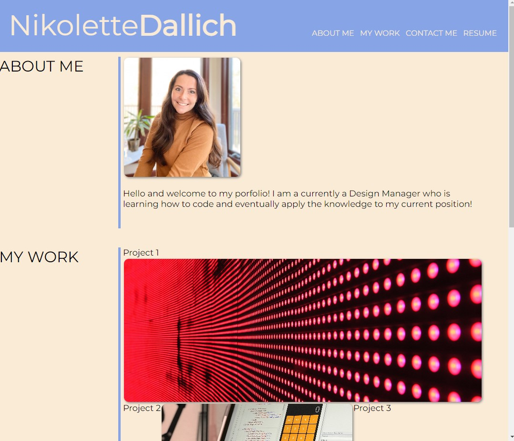

# My Portfolio

## Description
This is my (Nikolette Dallich) portfolio. I built this website to use as my professional portfolio for future use. I learned how to use the <aside> element in this project to have sections side by side. 

## Usage

To navigate to the website, click [Here](https://ndallich1.github.io/portfolio/)

# Credits 

Brad Dunn (Coding Boot Camp Instructor) & Grady Peck (Coding Boot Camp TA)

Montserrat font: Copyright 2011 The Montserrat Project Authors (https://github.com/JulietaUla/Montserrat)

This Font Software is licensed under the SIL Open Font License, Version 1.1.
This license is copied below, and is also available with a FAQ at:
http://scripts.sil.org/OFL

